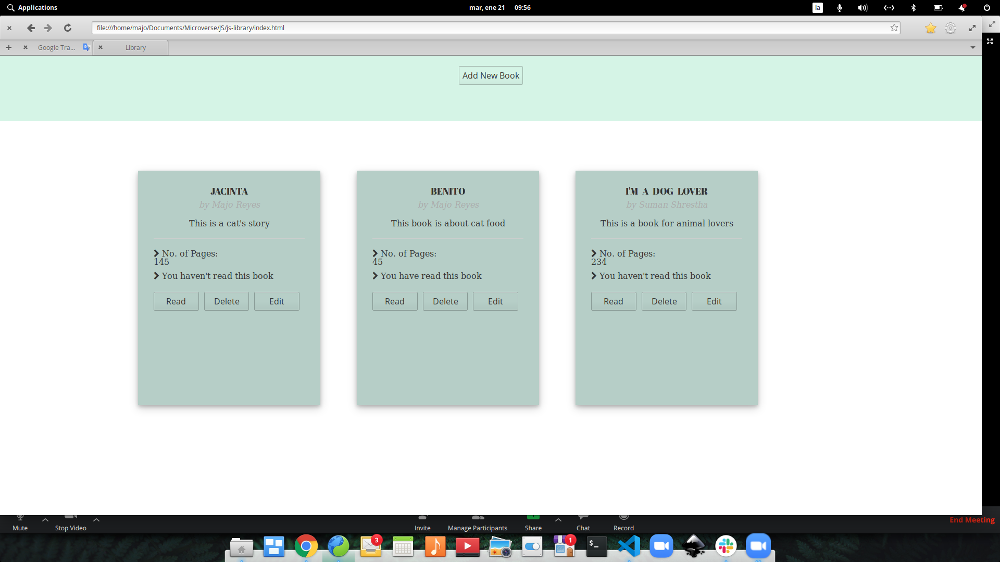

# Library app

> This project is a basic online Library.

This project has this characteristics:
  -  CRUD functionality.
  - Display stored books.
  - Store books in local storage.

## Built With

- HTML, CSS
- Javascript

## Settings

- Allow cookies from this site to store locally

## Live Demo

[Live Demo Link](https://majovanilla.github.io/js-library/)

## Authors

👤 **María Reyes**

- Github: [@majo_vanilla](https://github.com/majo_vanilla)
- Linkedin: [María José Reyes Parroquin](https://www.linkedin.com/in/majoreyesparroquin/)

👤 **Suman Shrestha**

- Github: [@sumancrest0001](https://github.com/sumancrest0001)

## 🤝 Contributing

Contributions, issues and feature requests are welcome!

Feel free to check the [issues page](issues/js-library).

## Show your support

Give a ⭐️ if you like this project!

## Acknowledgments

- Final Project of the Rails Section from the [Microverse Curriculum](https://www.microverse.org/)
- We followed the instructions of [The Odin Project](https://www.theodinproject.com/courses/javascript/lessons/library)

## 📝 License

Feel free to fork this project and improve it.
